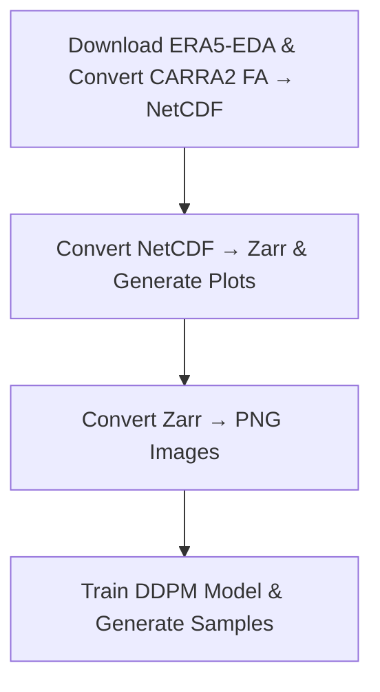

# CARRA-2 Uncertainty Estimation

This repository focuses on the computation of uncertainty estimates, also referred to as **Uncertainty Quantification (UQ)**, for the **Copernicus Arctic Regional Reanalysis second generation (CARRA2)**. **CARRA2** constitutes a high-resolution climate data product that assimilates an extensive temporal sequence of observations into the **HARMONIE model** and the three-dimensional variational (**3D-VAR**) **data assimilation** system, thereby yielding a highly precise representation of the atmospheric state. A fundamental component of the CARRA2 reanalysis involves the estimation of potential ensemble uncertainties associated with key climate variables.

The repository provides a detailed account of the installation procedure of the **AI** model called the **denoising diffusion probabilistic model (DDPM)**, a generative model on the **ECMWF ATOS** supercomputer. For the purpose of uncertainty quantification in both the **CARRA2** and **ERA5** datasets, the **DDPM** is employed within a **supervised learning** framework. In this approach, the uncertainty quantification derived from CARRA2 functions as the label, condition, or target for the model, which is trained using ERA5 data.

The **DDPM** framework formalizes the forward (noising) and reverse (denoising) processes as Markov chains. As a generative model, it estimates pixel-wise probability density functions (PDFs), necessitating pixel-level information from the input data during training. The forward process incrementally introduces Gaussian noise over T discrete steps, while the reverse process involves training a U-Net architecture to iteratively predict and remove noise at each step. This reverse denoising procedure is computationally intensive, requiring all T steps (for example, 4000 steps per image). Ultimately, the DDPM generates samples representing the uncertainty in CARRA2 during the reverse process.

A total of twenty variables were individually selected for model training. These comprised four surface or near-surface variables: **2-meter temperature (in kelvin), meridional and zonal wind components (in meters per second), and surface pressure (in hectopascals)**. Furthermore, **temperature (in kelvin), meridional and zonal wind components (in meters per second), and specific humidity (expressed as 10*g/kg)** were included at multiple pressure levels, namely **500 hPa, 700 hPa, 900 hPa, and 950 hPa**.


## Repository Structure

There are four directory trees in total, structured as follows:

---

### 1. S1_era5and_carra2NetCDF

**Contains:**
- A script to download ERA5-EDA data (`Fetch_ERA5EDA.sh`)
- A script to convert model-simulated CARRA values from FA format to NetCDF (`FAtoNetCDF.job`)

```
S1_era5and_carra2NetCDF
├── FAtoNetCDF.job
├── FAtoNetCDF.py
├── Fetch_ERA5EDA.sh
└── list_params_carra2.txt
```

---

### 2. S2_netCDFtozarr

**Contains:**
- A script to convert NetCDF to Zarr format (`netCDFtozarr.job`).
- Generates multiple plots based on available date and time.

```
S2_netCDFtozarr
├── config.py
├── CONVERT2ZARR_CARRA2.py
├── CONVERT2ZARR_ERA5.py
├── netCDFtozarr.job
├── process_data_CARRA2.py
└── process_data_ERA5.py
```

---

### 3. S3_zarrTOimage

**Contains:**
- A script to generate PNG images from Zarr data (`zarrToImage.job`).
- Output is used as the final input for the DDPM ML model.

```
S3_zarrTOimage
├── carra2_zarrToimage.py
├── era5_zarrToimage.py
└── zarrToImage.job
```

---

### 4. S4_ddpm

**Contains:**
- A Python script executed via batch job (`Run_Forward.job`) for training.
- A Python script executed via batch job (`Run_Sampling.job`) for sampling.

```
S4_ddpm
├── INPUT_DATA
├── Run_Forward.job
├── Run_Sampling.job
├── Sample_Main.py
├── src_diffusion
│   ├── diffusion_dist.py
│   ├── diffusion_fp16.py
│   ├── diffusion_gaussian.py
│   ├── diffusion_script.py
│   ├── diffusion_train.py
│   ├── image_datasets.py
│   ├── logger.py
│   ├── losses.py
│   ├── nn.py
│   ├── resample.py
│   ├── respace.py
│   └── unet.py
└── Train_Main.py
```

---

## Workflow Diagram

Below is the workflow for the repository:



---

## Authors
**Swapan Mallick, SMHI;**
**Kasper Skjold Tølløse, DMI;**
**& Per Dahlgrene, Met-NOR**
