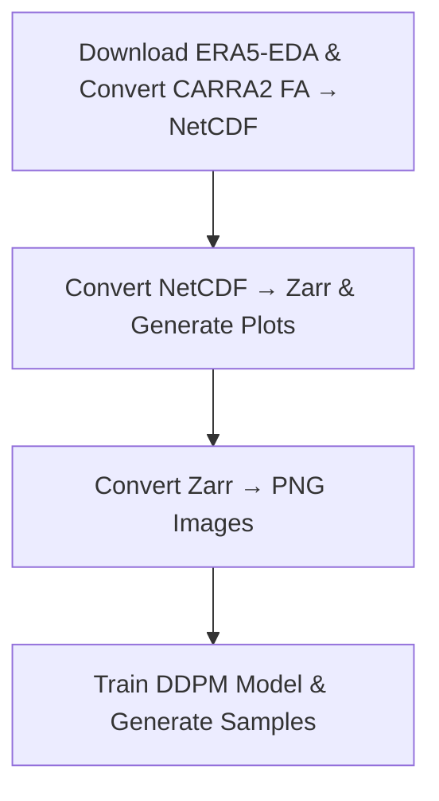

# CARRA-2 Uncertainty Estimation

This repository is for calculating the **CARRA-2 uncertainty estimation**.

## Repository Structure

There are four directory trees in total, structured as follows:

---

### 1. S1_era5and_carra2NetCDF

**Contains:**
- A script to download ERA5-EDA data (`Fetch_ERA5EDA.sh`)
- A script to convert model-simulated CARRA values from FA format to NetCDF (`FAtoNetCDF.job`)

```
S1_era5and_carra2NetCDF
├── FAtoNetCDF.job
├── FAtoNetCDF.py
├── Fetch_ERA5EDA.sh
└── list_params_carra2.txt
```

---

### 2. S2_netCDFtozarr

**Contains:**
- A script to convert NetCDF to Zarr format (`netCDFtozarr.job`).
- Generates multiple plots based on available date and time.

```
S2_netCDFtozarr
├── config.py
├── CONVERT2ZARR_CARRA2.py
├── CONVERT2ZARR_ERA5.py
├── netCDFtozarr.job
├── process_data_CARRA2.py
└── process_data_ERA5.py
```

---

### 3. S3_zarrTOimage

**Contains:**
- A script to generate PNG images from Zarr data (`zarrToImage.job`).
- Output is used as the final input for the DDPM ML model.

```
S3_zarrTOimage
├── carra2_zarrToimage.py
├── era5_zarrToimage.py
└── zarrToImage.job
```

---

### 4. S4_ddpm

**Contains:**
- A Python script executed via batch job (`Run_Forward.job`) for training.
- A Python script executed via batch job (`Run_Sampling.job`) for sampling.

```
S4_ddpm
├── INPUT_DATA
├── Run_Forward.job
├── Run_Sampling.job
├── Sample_Main.py
├── src_diffusion
│   ├── diffusion_dist.py
│   ├── diffusion_fp16.py
│   ├── diffusion_gaussian.py
│   ├── diffusion_script.py
│   ├── diffusion_train.py
│   ├── image_datasets.py
│   ├── logger.py
│   ├── losses.py
│   ├── nn.py
│   ├── resample.py
│   ├── respace.py
│   └── unet.py
└── Train_Main.py
```

---

## Workflow Diagram

Below is the workflow for the repository:



---

## Authors
**Swapan Mallick, SMHI**
**Kasper Skjold Tølløse, DMI**
